# Vultant Glasses Alpha App

## Libraries
 - react navigation:
   - https://reactnavigation.org/docs/4.x/getting-started
 - async-storage:
   - https://react-native-async-storage.github.io/async-storage/docs/usage
 - notification:
   - https://github.com/leandrosimoes/react-native-android-notification-listener
 - bluetooth:
   - https://github.com/Polidea/react-native-ble-plx

## Useful link

 - Text format conversion: https://www.branah.com/unicode-converter

## TODO (HIGH Priority):
 - Notification warning: [Sat Feb 20 2021 16:11:54.296]  WARN   ..  registerHeadlessTask or registerCancellableHeadlessTask called multiple times for same key 'RNAndroidNotificationListenerHeadlessJs' --> close app, then open app again
 - Constant loop to try to get to bluetooth device.

 - make it work on iOS; Might need to add if-else statement to enable/disable different functions that don't work on iOS; Might need to do pod install.etc.
 - Try to connect to saved BLE. If fail, re-direct to choose device page.
 - Create 2 different types of settings: Global Settings and Glasses Settings

## TODO: 
 - BUG: BleError: Device ? is already connected --> connect to device -> close app -> open again -> try to connect to saved ble.
 - You can use this and not need to pass characteristics around:
   - https://github.com/Polidea/react-native-ble-plx/wiki/Characteristic-Reading
 ```
 bleManager.readCharacteristicForDevice(
  deviceIdentifier: DeviceId,
  serviceUUID: UUID,
  characteristicUUID: UUID,
  transactionId: ?TransactionId
): Promise<Characteristic>
```
 - Follow this: https://www.polidea.com/blog/ReactNative_and_Bluetooth_to_An_Other_level/
 - Add video/screenshot of current version.
 - Integrate notification -> Had to add length limitation.
 - Notification Permission improvement.
 - BLE message limitation problem.
 - move BLEMenu to be part of Settings (or better hide/show)
 - BLE permission stuff.
 - Figure out how to get settings from smartglasses. Can we get notes info as well?
 - Implement persistence storage for notes, cue-card.
 - More work on settings
 - BLEManager issue. Need to share characteristic?
 - Centralize styles


## How to use?

 - Allow location permission for app.
 - If first-time, select "Choose Device" -> "Start Scanning" -> Choose a Device -> A modal will pop up, select 继续 -> Select a Service -> Select a Characteristics.
 - Check that the "Characteristics Connected" is True. If so, go to Screens section and choose one of the buttons. If not, this is an error.
 - If not first-time, you can connect to "Saved BLE" by clicking "Connect to saved ble". Alternatively, you can connect to a new/different device/characteristics by clicking "Choose Device".
 - In every screen, the top part is used to write the respective messages to the peripheral BLE device. The bottom "READ DEBUG" part is just for debugging purposes; making it easier to check the written message is written properly.

## Log
 - 20210124: Ensured react-navigation is functional.
 - 20210125: Set up a structure for the entire app.
   - [FIXED] Problem (stuck):
     - Bluetooth functionality is not provided on emulators; need to use physical device. However, my usb-c cable is gone. During this quarantine, I need to find a way to get a usb-c cable.
   - Result:

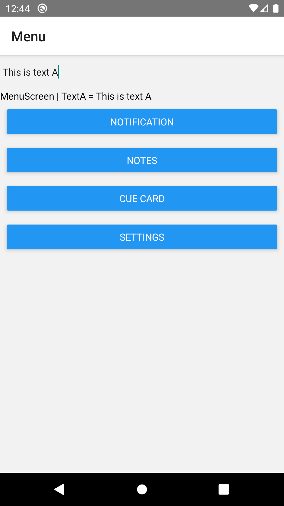
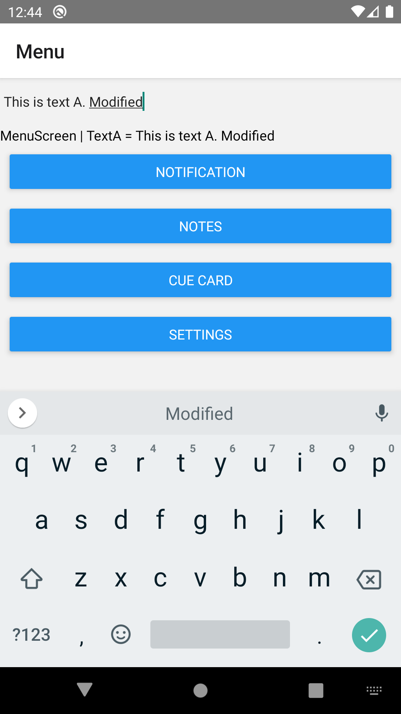
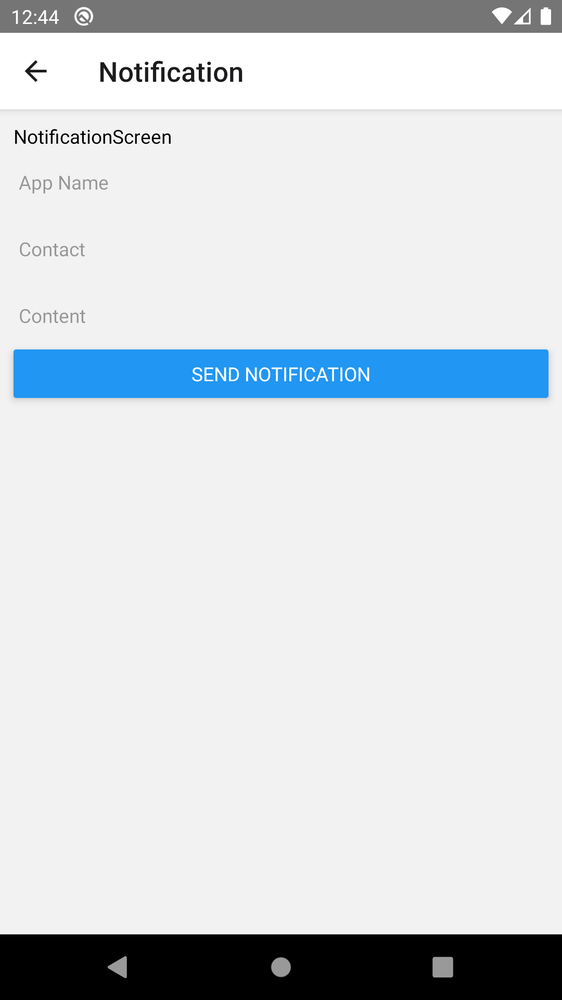
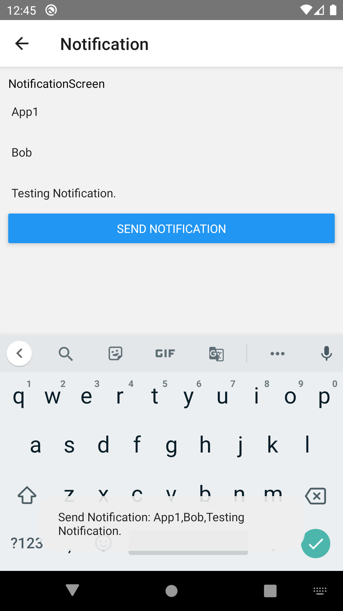
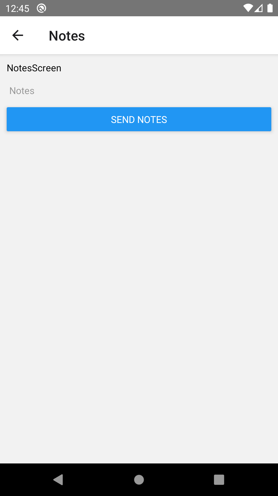
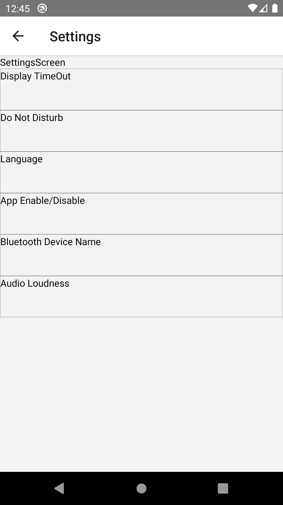

 - 20210125: Completed Notification, Notes and CueCard basic functionality. Implemented persistence storage.
   - Problem (to be fixed):
     - Currently, if Choose Device -> Start BLE connection -> will get error (cuz using two instance of BleManager?). Not sure if we should share characteristics between MenuScreen and BLEMenu? Or solve it by closing the manager instance?
   - Result:
  
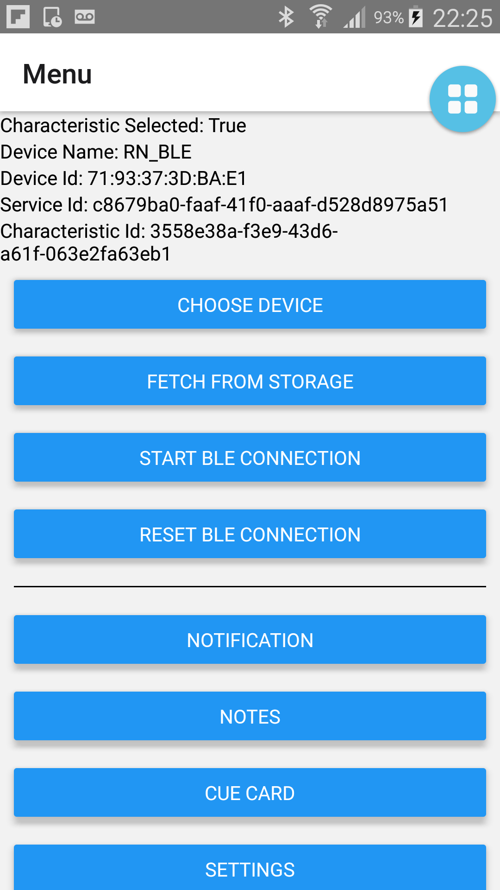
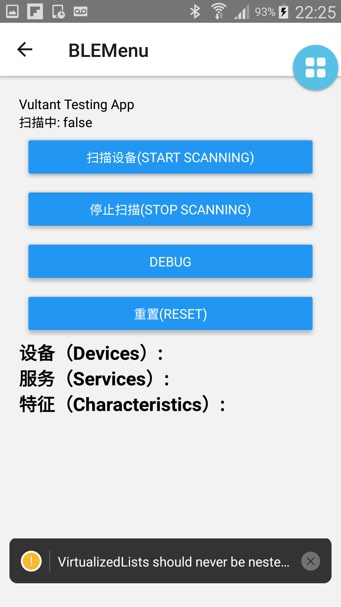
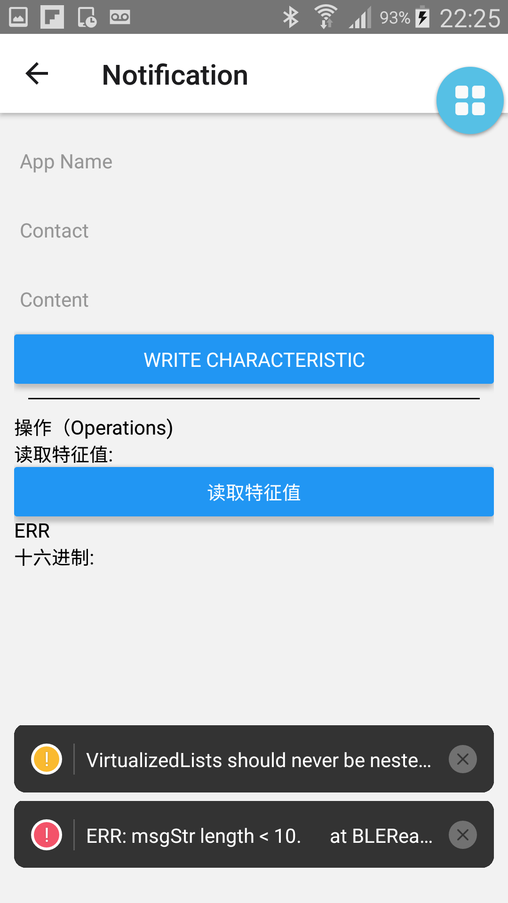
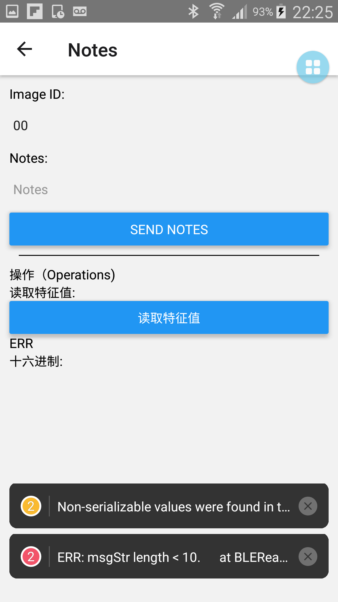
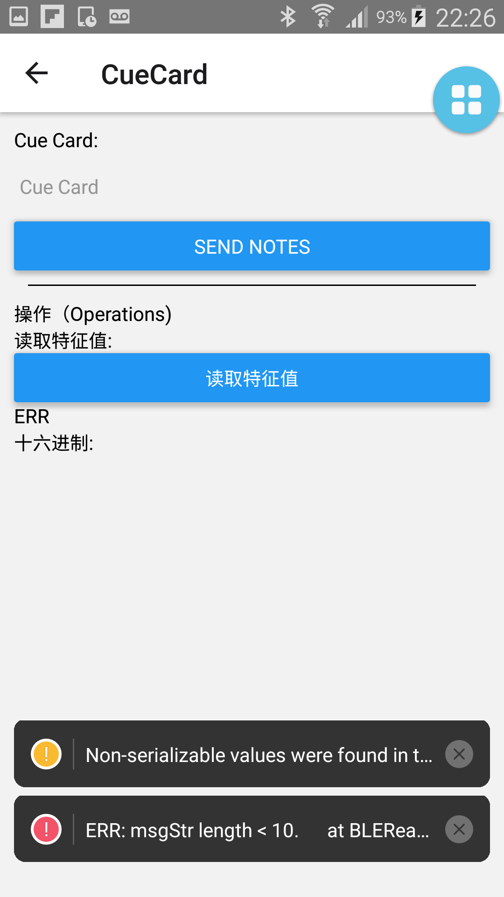
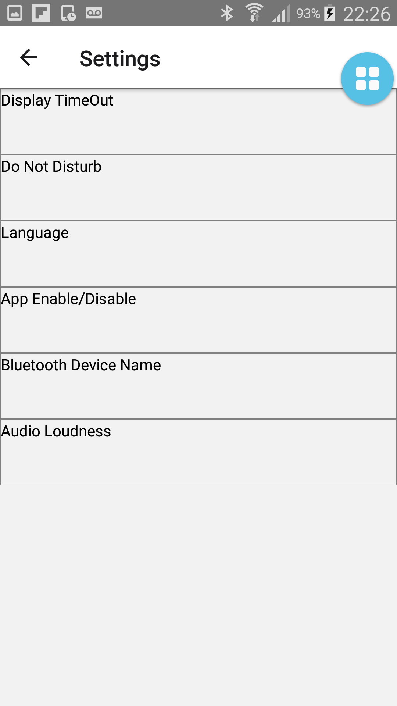

## Export to apk
https://stackoverflow.com/questions/35935060/how-can-i-generate-an-apk-that-can-run-without-server-with-react-native

 - Specifically, run this in project folder
```bash
$ keytool -genkey -v -keystore my-upload-key.keystore -alias my-key-alias -keyalg RSA -keysize 2048 -validity 10000
```

 - Place the my-release-key.keystore file under the android/app directory in your project folder. 
 
 - Edit android/app/build.gradle and android/gradle.properties as seen in https://github.com/awsk1994/Bluetooth-BLE-React-App/commit/a653d0d0b2cf63629c9b2d43a6f92554d94dc316
   - replace 'vultant' with the password you set for keytool

 - Run this:
```
cd android && ./gradlew assembleRelease
```

 - Find your signed apk under android/app/build/outputs/apk/app-release.apk


## Appendix:
```
Alexs-MacBook-Pro-3:VultantGlassesAlpha2 alexwong$ keytool -genkey -v -keystore my-release-key.keystore -alias my-key-alias -keyalg RSA -keysize 2048 -validity 10000
Enter keystore password:  
Re-enter new password: 
What is your first and last name?
  [Unknown]:  Alex
What is the name of your organizational unit?
  [Unknown]:  Vultant
What is the name of your organization?
  [Unknown]:  Vultant
What is the name of your City or Locality?
  [Unknown]:  Hong Kong
What is the name of your State or Province?
  [Unknown]:  Hong Kong
What is the two-letter country code for this unit?
  [Unknown]:  HK
Is CN=Alex, OU=Vultant, O=Vultant, L=Hong Kong, ST=Hong Kong, C=HK correct?
  [no]:  yes

Generating 2,048 bit RSA key pair and self-signed certificate (SHA256withRSA) with a validity of 10,000 days
	for: CN=Alex, OU=Vultant, O=Vultant, L=Hong Kong, ST=Hong Kong, C=HK
Enter key password for <my-key-alias>
	(RETURN if same as keystore password):  
Re-enter new password: 
[Storing my-release-key.keystore]

all password is "password"
```