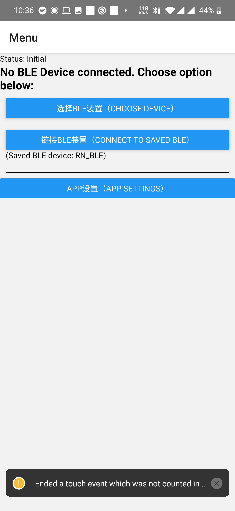
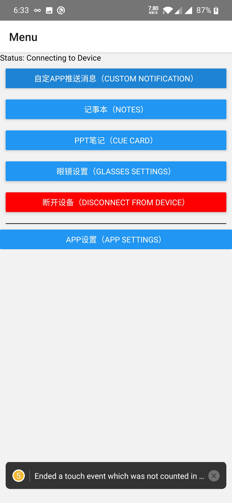
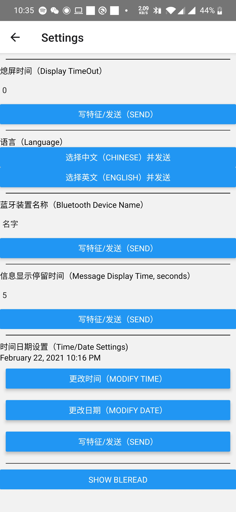
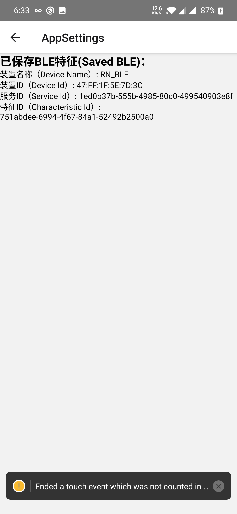

# Vultant Glasses Alpha App

## Libraries
 - react navigation:
   - https://reactnavigation.org/docs/4.x/getting-started
 - async-storage:
   - https://react-native-async-storage.github.io/async-storage/docs/usage
 - notification:
   - https://github.com/leandrosimoes/react-native-android-notification-listener
 - bluetooth:
   - https://github.com/Polidea/react-native-ble-plx
 - timedate picker:
   - https://github.com/react-native-datetimepicker/datetimepicker
 - moment (time/date processing):
   - https://github.com/moment/moment
 - react-native-loading-spinner-overlay:
   - https://github.com/joinspontaneous/react-native-loading-spinner-overlay/blob/master/example/App.js
 - react-native-permissions
   - https://github.com/zoontek/react-native-permissions


## Useful link
 - Text/Data format conversion: https://www.branah.com/unicode-converter

# TODO:
### High (Essential) Priority:
 - [BUG] status is "connecting to device" after choosing a device to connect and connected successfully.

 - Alert on BleError and suggest actions (eg. restart bluetooth)
 - Implement persistence storage for notes, cue-card, settings.

 - [Need to test] react-native permissions implementation on iOS.
 - Prettify Settings --> Should do custom modal to change text and numbers, instead of going ot next screen...
 - Language selection

 - [Notification message] -> appName conversion (eg. com.whatsapp -> whatsapp), get app list name from android/ios

 - Logging/Debugging

### Medium (Good to have) Priority:
 - Centralize styles
 - Try to connect to saved BLE. If fail, alert and suggest to go choose device page.
 - Add global settings to log ToastAndroid (Developer mode settings)
 - Cover as much error cases as possible: permissions not enabled error, bluetooth not enabled error, repeat on/off scanning continuously error, 
   - repeat on/off scanning continuously error:
     - errorCode: 600
     - Solution: turn off bluetooth, wait for 5 seconds, turn on bluetooth, try again
   - Device already connected error:
   

### Low Priority:
 - Can spinner overlay have a cancel button?

### Super Low Priority:
 - You can use this and not need to pass characteristics around:
   - https://github.com/Polidea/react-native-ble-plx/wiki/Characteristic-Reading
 ```
 bleManager.readCharacteristicForDevice(
  deviceIdentifier: DeviceId,
  serviceUUID: UUID,
  characteristicUUID: UUID,
  transactionId: ?TransactionId
): Promise<Characteristic>
```
 - [No solution/fix atm] Notification warning: [Sat Feb 20 2021 16:11:54.296]  WARN   ..  registerHeadlessTask or registerCancellableHeadlessTask called multiple times for same key 'RNAndroidNotificationListenerHeadlessJs' --> close app, then open app again

# Bug
 - [Temporary Fix by increasing MTU] !!BUG!!: When message is too long (settings content of 8 letters - "NO NAME)"), there'll be write operation timeout. NEED TO FIX. Afterwards, any bluetooth operation fails. NEED TO FIX THIS TOO!
 - [To confirm, not reproducible] BUG: BleError: Device ? is already connected --> connect to device -> close app -> open again -> try to connect to saved ble.

# How to use?
 - Allow location permission for app.
 - If first-time, select "Choose Device" -> "Start Scanning" -> Choose a Device -> A modal will pop up, select 继续 -> Select a Service -> Select a Characteristics.
 - Check that the "Characteristics Connected" is True. If so, go to Screens section and choose one of the buttons. If not, this is an error.
 - If not first-time, you can connect to "Saved BLE" by clicking "Connect to saved ble". Alternatively, you can connect to a new/different device/characteristics by clicking "Choose Device".
 - In every screen, the top part is used to write the respective messages to the peripheral BLE device. The bottom "READ DEBUG" part is just for debugging purposes; making it easier to check the written message is written properly.

# Test Coverage:
 - notification appAllowList, blockList (can test via Hangout)
 - Permissions Request
 - Enable bluetooth upon bluetooth status change
 - Notifications Request (for Android)
 - Search + Connect bluetooth device
 - Persistence Storage
 - Send/Save
 
# Error Solve:
 - Make sure bluetooth is on
 - Restart bluetooth
 - Restart app
 - Bluetooth permission, Notification Permission, bluetooth is on.

# Log
 - 20210226: Deployed Test App on physical iPhone device.

 - 20210220: Refined many small things, made UI and workflow more simplistic, bug fixes, made utilization of bleManager more smooth.






 - 20210124: Ensured react-navigation is functional.
 - 20210125: Set up a structure for the entire app.
   - [FIXED] Problem (stuck):
     - Bluetooth functionality is not provided on emulators; need to use physical device. However, my usb-c cable is gone. During this quarantine, I need to find a way to get a usb-c cable.
   - Result:


 - 20210125: Completed Notification, Notes and CueCard basic functionality. Implemented persistence storage.
   - Problem (to be fixed):
     - Currently, if Choose Device -> Start BLE connection -> will get error (cuz using two instance of BleManager?). Not sure if we should share characteristics between MenuScreen and BLEMenu? Or solve it by closing the manager instance?
   - Result:
  


## Export to apk
https://stackoverflow.com/questions/35935060/how-can-i-generate-an-apk-that-can-run-without-server-with-react-native

 - Specifically, run this in project folder
```bash
$ keytool -genkey -v -keystore my-release-key.keystore -alias my-key-alias -keyalg RSA -keysize 2048 -validity 10000
```

 - Place the my-release-key.keystore file under the android/app directory in your project folder. 
 
 - Edit android/app/build.gradle and android/gradle.properties as seen in https://github.com/awsk1994/Bluetooth-BLE-React-App/commit/a653d0d0b2cf63629c9b2d43a6f92554d94dc316
   - replace 'vultant' with the password you set for keytool

 - Run this (in the future, you just need to run below to export a new apk):
```
cd android && ./gradlew assembleRelease
```

 - Find your signed apk under android/app/build/outputs/apk/app-release.apk


## Make it work on ios

1. open xcode and open project directory's ios folder
2. Project -> Vultant* -> Deployment Target -> iOS deployment target -> set to the iOS version running on the iPhone
3. Targets -> Vultant* -> Signing and Capabilities -> select team (may need to login to Apple developer account, but no need Apple developer membership at this stage yet)
4. Make sure you link/follow instructions for linking libraries that you use. For example you might need to run 'react-native link <library>' or Insert things into InfoList.
5. On top (where the play button is), look to the right and select your connected iPhone.
6. Then build (by pressing the play button)

Might be useful link: https://www.cnblogs.com/lude1994/p/11078095.html


## Appendix:
```
Alexs-MacBook-Pro-3:VultantGlassesAlpha2 alexwong$ keytool -genkey -v -keystore my-release-key.keystore -alias my-key-alias -keyalg RSA -keysize 2048 -validity 10000
Enter keystore password:  
Re-enter new password: 
What is your first and last name?
  [Unknown]:  Alex
What is the name of your organizational unit?
  [Unknown]:  Vultant
What is the name of your organization?
  [Unknown]:  Vultant
What is the name of your City or Locality?
  [Unknown]:  Hong Kong
What is the name of your State or Province?
  [Unknown]:  Hong Kong
What is the two-letter country code for this unit?
  [Unknown]:  HK
Is CN=Alex, OU=Vultant, O=Vultant, L=Hong Kong, ST=Hong Kong, C=HK correct?
  [no]:  yes

Generating 2,048 bit RSA key pair and self-signed certificate (SHA256withRSA) with a validity of 10,000 days
	for: CN=Alex, OU=Vultant, O=Vultant, L=Hong Kong, ST=Hong Kong, C=HK
Enter key password for <my-key-alias>
	(RETURN if same as keystore password):  
Re-enter new password: 
[Storing my-release-key.keystore]

all password is "password"
```

